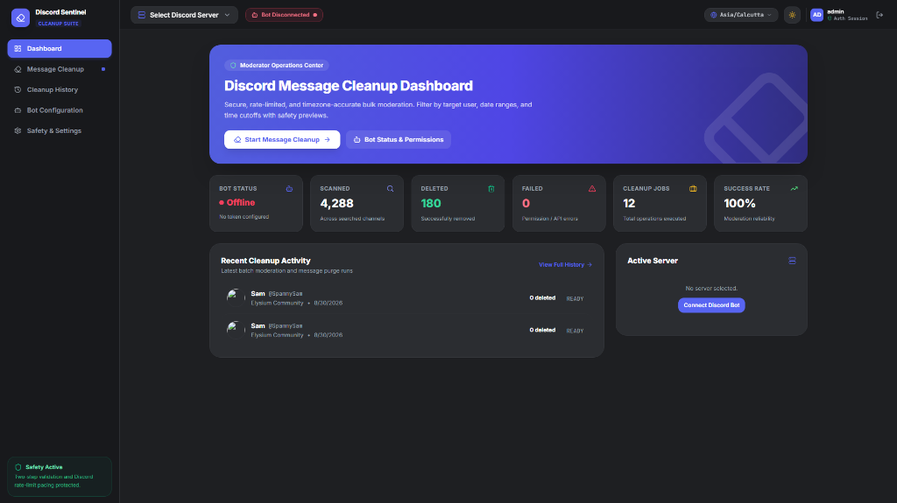
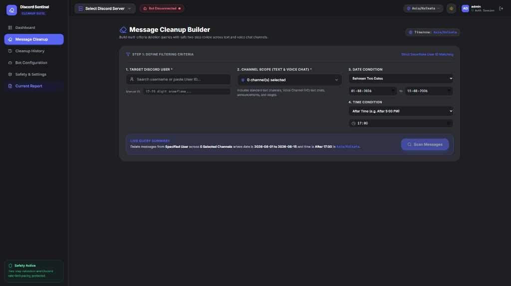
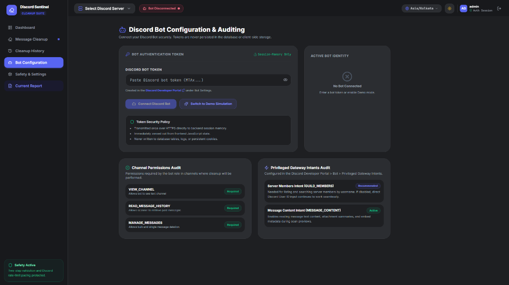
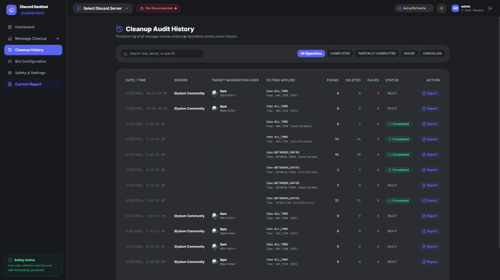
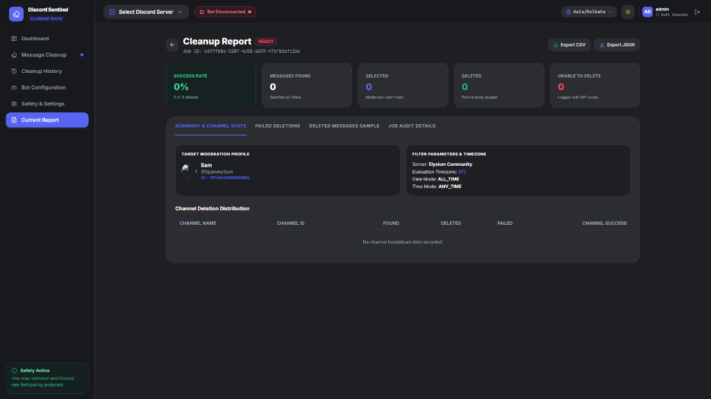
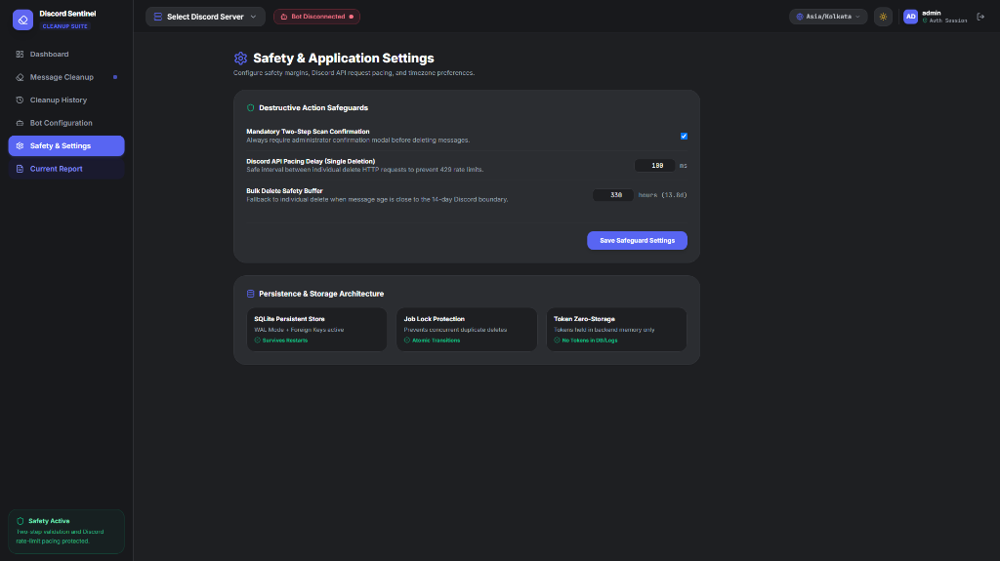

# Discord Message Cleanup Dashboard

[](https://github.com/Yavagu/discord-message-cleanup-dashboard/actions/workflows/ci.yml)
[](https://nodejs.org/)
[](LICENSE)

A high-performance, professional moderation and bulk message purge dashboard for Discord server administrators. Securely connect your Discord bot, configure granular multi-criteria filters (immutable Snowflake User IDs, date boundaries, and time-of-day cutoffs in any IANA timezone), preview matching messages with interactive controls, and safely execute bulk deletions with Discord API rate-limit pacing and real-time SSE progress streaming.



---

## Table of Contents

- [Key Features](#key-features)
- [Screenshots](#screenshots)
- [Architecture & Tech Stack](#architecture--tech-stack)
- [Prerequisites](#prerequisites)
- [Installation & Setup](#installation--setup)
- [Discord Bot & Application Setup](#discord-bot--application-setup)
- [Required Permissions & Gateway Intents](#required-permissions--gateway-intents)
- [Development & Build Commands](#development--build-commands)
- [Security Architecture](#security-architecture)
- [Deletion Engine & Rate Limit Management](#deletion-engine--rate-limit-management)
- [Timezone & Timestamp Processing](#timezone--timestamp-processing)
- [Runtime Data & SQLite Persistence Warning](#runtime-data--sqlite-persistence-warning)
- [Project Structure](#project-structure)
- [Troubleshooting](#troubleshooting)
- [Limitations](#limitations)
- [Legal & Discord Terms of Service Compliance](#legal--discord-terms-of-service-compliance)
- [License](#license)

---

## Key Features

1. **Ephemeral In-Memory Bot Credentials**:
   - Bot tokens are provided via password-masked inputs and held strictly in volatile backend session memory.
   - **Never persisted** to SQLite, `.env` files, configuration JSONs, client `localStorage`, or disk logs.
   - Server-side logging interceptors automatically redact credentials and sensitive tokens.

2. **Immutable Snowflake User ID Targeting**:
   - Deletion rules strictly enforce 17–20 digit Discord Snowflake User ID matching (`message.author.id === targetUserId`).
   - Prevents accidental deletion risks caused by mutable usernames or display nicknames.

3. **Timezone-Aware Filtering Engine**:
   - Evaluates date and time rules against any specified IANA timezone (e.g. `Asia/Kolkata`, `America/New_York`, `UTC`, `Europe/London`).
   - Supports:
     - **Date Filter**: Exact Date, Before Date, After Date, Date Range, Today, Yesterday, Last 7 Days, Last 30 Days.
     - **Time Filter**: Any Time, After Time (e.g. after 17:00 / 5:00 PM), Before Time, Time Window (e.g. 09:00 to 17:00).
     - **Compound Filtering**: Combined date range and time window conditions.

4. **14-Day Bulk Deletion Segmentation**:
   - Messages $\le 13.85$ days old are grouped into Discord bulk delete batches (2–100 messages per request) for rapid cleanup.
   - Messages $> 14$ days old are automatically routed to paced single-message deletion endpoints.

5. **Interactive Preview & Server Revalidation**:
   - Filter, search, and paginate scanned messages before committing any destructive action.
   - Server-side revalidation ensures that only messages validated in the scan phase for the active job, guild, and channel are deleted.

6. **Real-Time SSE Progress & Failure Telemetry**:
   - Live Server-Sent Events (SSE) stream deletion progress, channel updates, ETA, and cancellation triggers.
   - Detailed post-job failure audit breakdown with standard Discord error codes (`50013`, `10008`, `50034`, `50001`, `429`).
   - Export audit reports directly to **CSV** or **JSON**.

7. **Zero-Setup Demo Simulation Mode**:
   - Built-in simulation with realistic mock Discord servers, channels, members, and messages for testing without needing a live bot token immediately.

---

## Screenshots

<details>
<summary><b>📸 Click to Expand / View Full UI Screenshots (6 Views)</b></summary>
<br>

### 1. Operations Center & Dashboard Overview


### 2. Multi-Criteria Message Cleanup Builder


### 3. Bot Configuration & Channel / Gateway Intent Audit


### 4. Persistent Cleanup Audit History


### 5. Detailed Cleanup Report & Channel Deletion Breakdown


### 6. Destructive Safeguards & Application Settings


</details>

---

## Architecture & Tech Stack

- **Frontend**:
  - React 18 with TypeScript
  - Vite for fast bundling
  - Tailwind CSS + Lucide Icons for modern, responsive UI
  - Luxon for client-side timezone formatting and relative time calculations
- **Backend**:
  - Node.js (v22+ / v24+) + Express
  - Node.js built-in `node:sqlite` (`DatabaseSync`) with Write-Ahead Logging (WAL) enabled
  - Server-Sent Events (SSE) for live deletion progress broadcasting
  - Zod for request validation and schema enforcement
- **Security & Middleware**:
  - `HttpOnly`, `SameSite=Strict` cookie-based admin session authentication
  - Cryptographically secure CSRF tokens for mutating HTTP requests
  - In-memory volatile token cache keyed by session ID

---

## Prerequisites

- **Node.js**: `v22.0.0` or higher (Node 22.5.0+ or Node 24.x recommended for native `node:sqlite` support)
- **npm**: `v10.0.0` or higher
- **Discord Bot**: Created on the [Discord Developer Portal](https://discord.com/developers/applications) with appropriate permissions.

---

## Installation & Setup

1. **Clone the repository**:
   ```bash
   git clone https://github.com/Yavagu/discord-message-cleanup-dashboard.git
   cd discord-message-cleanup-dashboard
   ```

2. **Install dependencies**:
   ```bash
   # Install root orchestration tools
   npm install

   # Install server and client packages
   npm --prefix server install
   npm --prefix client install
   ```

3. **Configure Environment**:
   ```bash
   # Create server .env from template
   cp .env.example .env
   # Or on Windows PowerShell:
   Copy-Item .env.example .env
   ```
   Edit `.env` to set your desired `ADMIN_PASSWORD` and `PORT`.

4. **Start Development Servers**:
   ```bash
   npm run dev
   ```
   - **Frontend UI**: [http://localhost:5173](http://localhost:5173)
   - **Backend API**: [http://localhost:3001](http://localhost:3001)

5. **Default Admin Login**:
   - Default Password: `admin123` (or whatever is set in `ADMIN_PASSWORD`)
   - Alternatively, click **"Launch Demo Simulation"** on the login screen for instant offline sandbox testing.

---

## Discord Bot & Application Setup

To use the dashboard with a live Discord server:

1. Navigate to the [Discord Developer Portal](https://discord.com/developers/applications) and click **"New Application"**.
2. Go to the **Bot** tab on the left sidebar:
   - Click **"Reset Token"** to generate a bot token. Copy this token (keep it safe and private).
   - Under **Privileged Gateway Intents**, enable:
     - **Server Members Intent** (`GUILD_MEMBERS`) — Required to search and resolve members.
     - **Message Content Intent** (`MESSAGE_CONTENT`) — Recommended for message preview content.
3. Invite the bot to your Discord server:
   - Go to **OAuth2** $\rightarrow$ **URL Generator**.
   - Select scopes: `bot`.
   - Select bot permissions:
     - `View Channels`
     - `Read Message History`
     - `Manage Messages`
   - Copy the generated URL into your browser to invite the bot to your server.

---

## Required Permissions & Gateway Intents

| Permission / Intent | Type | Required For |
| :--- | :--- | :--- |
| `VIEW_CHANNEL` | Channel Permission | Accessing text channels to inspect message history. |
| `READ_MESSAGE_HISTORY` | Channel Permission | Fetching past messages for filter evaluation. |
| `MANAGE_MESSAGES` | Channel Permission | Deleting messages authored by target users. |
| `GUILD_MEMBERS` | Privileged Gateway Intent | Searching and selecting server members in the UI. |
| `MESSAGE_CONTENT` | Privileged Gateway Intent | Reading message content for previewing before purge. |

---

## Development & Build Commands

| Command | Description |
| :--- | :--- |
| `npm run dev` | Runs both client (Vite) and server concurrently with hot reload. |
| `npm run dev:server` | Starts the Express server with `tsx watch`. |
| `npm run dev:client` | Starts the Vite React development server. |
| `npm run build` | Compiles server TypeScript and builds client production assets. |
| `npm test` | Runs the automated backend test suite (filter rules, 14-day cutoff, auth, SQLite). |
| `npm start` | Runs the compiled production server from `server/dist/index.js`. |

---

## Security Architecture

> [!CAUTION]
> **NEVER COMMIT YOUR DISCORD BOT TOKEN TO GIT.**
> Discord bot tokens grant API control over your bot and should never be pushed to GitHub, posted in issues, or added to `.env` files committed to version control.

- **Volatile Token Storage**: When you connect a bot token in the UI, it is sent over an encrypted HTTPS connection and held strictly in a `Map<sessionId, token>` in server memory. When your session ends or server restarts, all tokens are immediately wiped.
- **CSRF Token Validation**: Every state-changing API request (`POST`, `PUT`, `DELETE`) requires a matching `X-CSRF-Token` header.
- **Redacting Logger**: The server logger automatically intercepts output to sanitize and strip authentication tokens before printing.

---

## Deletion Engine & Rate Limit Management

The cleanup engine handles Discord's REST API constraints:

1. **14-Day Bulk Delete Rule**: Discord's bulk deletion endpoint (`POST /channels/{channel.id}/messages/bulk-delete`) strictly forbids deleting messages older than 14 days. The dashboard automatically calculates message age:
   - Messages $\le 13.85$ days old: Grouped into chunks of up to 100 messages.
   - Messages $> 14$ days old: Dispatched individually through `DELETE /channels/{channel.id}/messages/{message.id}` with safety delay.
2. **HTTP 429 Handling**: Automatically reads `Retry-After` headers and pauses execution until rate-limit windows expire.
3. **Atomic Execution Locks**: Only one deletion job can execute concurrently per session to prevent race conditions.

---

## Timezone & Timestamp Processing

Discord stores all timestamps in UTC ISO-8601 format. This dashboard utilizes `luxon` to project UTC timestamps into the target IANA timezone:

```
Discord Message (UTC: 2026-08-10 12:00:00Z)
  │
  ▼
Project to Target Timezone (Asia/Kolkata / IST +05:30)
  │
  ▼
Local Timestamp (2026-08-10 17:30:00 IST)
  │
  ▼
Evaluates against Filter: "After 17:00 (5:00 PM)" ──► MATCH (Keep for Deletion)
```

---

## Runtime Data & SQLite Persistence Warning

> [!IMPORTANT]
> **Source Code vs. Runtime Moderation Data**:
> This GitHub repository contains the **source code** for the dashboard application.
> The SQLite database file (`server/data/cleanup_dashboard.db`) contains your local runtime moderation history, job audit trails, and failure logs.
>
> - The database is explicitly excluded in `.gitignore` and **will NOT be stored in Git or uploaded to GitHub**.
> - If you wish to preserve or migrate your cleanup history across machines, back up the `server/data/` folder independently.

---

## Project Structure

```
discord-message-cleanup-dashboard/
├── .github/
│   ├── dependabot.yml          # Automated weekly dependency updates
│   └── workflows/
│       └── ci.yml              # GitHub Actions CI build & test pipeline
├── client/                     # Vite + React frontend
│   ├── src/
│   │   ├── components/         # UI components (Navbar, Sidebar, LoginGate, Modals)
│   │   ├── context/            # Global AppContext state
│   │   ├── services/           # Typed API service client
│   │   ├── views/              # Dashboard, Cleanup Builder, Report, History, Settings
│   │   └── types/              # Frontend TypeScript definitions
│   └── package.json
├── server/                     # Express + Node.js backend
│   ├── data/                   # SQLite database (ignored by Git)
│   ├── src/
│   │   ├── db/                 # Database schema & WAL mode initialization
│   │   ├── middleware/         # Admin auth & CSRF protection
│   │   ├── routes/             # REST endpoints & SSE progress stream
│   │   ├── services/           # Deletion, Scanner, Filter, Bot, Guild, History services
│   │   ├── tests/              # Test suite (timezone, 14-day cutoff, auth)
│   │   └── utils/              # Redacting logger
│   └── package.json
├── .env.example                # Sample environment configuration template
├── .gitignore                  # Git ignore rules for node_modules, builds, DBs & secrets
├── README.md                   # Project documentation
├── SECURITY.md                 # Security & vulnerability reporting policy
└── package.json                # Root orchestration & scripts
```

---

## Troubleshooting

### Bot cannot find messages in a channel
- Verify the bot has `View Channels` and `Read Message History` permissions in that specific channel (channel permission overrides can take precedence over server roles).
- If the channel is a Thread or Forum, ensure the bot has permission to view threads.

### Discord API returns `50013: Missing Permissions` during deletion
- Verify the bot has the `Manage Messages` permission in the channel.
- Ensure the bot's role is positioned appropriately in the Discord Server Role hierarchy.

### Messages older than 14 days fail to bulk-delete
- The dashboard automatically detects messages older than 14 days and routes them to individual deletion. For very old archives, individual deletion requires rate-limit pacing.

---

## Limitations

- **Discord REST Rate Limits**: Deletion speeds are bound by Discord API rate limits. Bulk deletion deletes up to 100 messages every ~1–2 seconds, while individual deletions are paced to prevent 429 penalties.
- **Direct Messages (DMs)**: Discord bots can only delete messages in Guild (Server) text channels, not private direct messages.

---

## Legal & Discord Terms of Service Compliance

- **Trademark**: Discord is a registered trademark of Discord Inc. This project is an independent tool and is not affiliated with, endorsed by, or sponsored by Discord Inc.
- **Compliance**: When deploying and operating a bot, server administrators are responsible for complying with the [Discord Developer Terms of Service](https://discord.com/developers/docs/policies-and-agreements/developer-terms-of-service) and [Discord Community Guidelines](https://discord.com/guidelines).

---

## License

This project is licensed under the **GNU General Public License v3.0** (GPLv3). See the [LICENSE](LICENSE) file for details.
